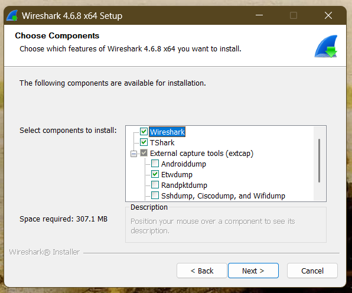
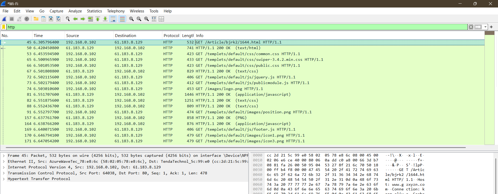

# Wireless Communications 
# Lab0 Basic wireshark operation and capture
###### tags: `Wireless Communications`

## 0. Install Wireshark and write a short installation guide. Include screenshots as evidence.
1. Download the installation file for Wireshark for your operating system from the official Wireshark site (https://www.wireshark.org/download.html).
2. Run the setup file and follow the instructions shown.
3. Choose the components that you want to install.
4. Select the install destination for the progam.
5. Wait untill the installation is finished and reboot the device .

## 1. Website Packet Capture 
### Which website did you access?
  [[www.wikipedia.org]](https://www.wikipedia.org)
### What are the IP address and port number of the website server?
- Server IP address: `35.201.82.166`
- Server port: `443` for HTTPS
### What are the IP address and source port number of your PC when initially accessing the website?
- PC IP address: `192.168.0.102`
- Source port number: `64144`
### What is the process of the TCP three-way handshake? Identify the SYN, SYN-ACK, and ACK packets. Briefly explain the purpose of each packet.

#### SYN
Packet number: `158`
`192.168.0.102 → 103.102.166.224`
The client sends a SYN packet to request the establishment of a TCP
connection with the server.
#### SYN-ACK
Packet number: `159`
`103.102.166.224 → 192.168.0.102`
The server sends a SYN-ACK packet to acknowledge the client's SYN and indicate that it is ready to establish the connection.
#### ACK
Packet number: `160`
`192.168.0.102 → 103.102.166.224`
The client sends an ACK packet to acknowledge the server's SYN-ACK.
After this packet, the TCP connection is established.
## 2. DNS Packet Analysis
### What are the IP address and port number of the DNS server?
- DNS server IP address: `140.118.31.99`
- DNS server port number: `53`

### What is the domain name in the DNS query?
www.wikipedia.org
### Which protocols does this DNS packet use? List the protocols from Layer 2 to Layer 5 in the TCP/IP five-layer model:
- Layer 2: Link Layer: Ethernet II
- Layer 3: Network Layer: Internet Protocol Version 4 IPv4
- Layer 4: Transport Layer: User Datagram Protocol UDP
- Layer 5: Application Layer: Domain Name System DNS
## 3. Access an HTTP page
### Which HTTP page did you access?
http://www.gzxyzn.com/Article/bjrk2/1644.html
### What are the IP address and port number of the server hosting the page?
- Server IP address: `61.183.8.129`
- Server port number: `80`
### What is the HTTP request method?
The HTTP request method is: `GET`
Packet `222` contains: `GET /Article/bjrk2/1644.html HTTP/1.1`
The GET method is used by the client to request a resource from the
web server.
### What is the HTTP response status code, and what does it mean?
The HTTP response status code is: `200 OK`
Packet `230` contains: `HTTP/1.1 200 OK`
The `200 OK` status code means that the request was successfully done.
  
